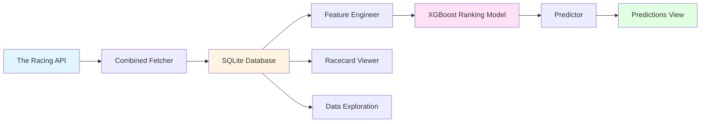

# QE2 - Horse Racing ML Prediction Platform

A comprehensive platform for collecting, analyzing, and predicting horse racing outcomes using machine learning. Features a full-stack GUI application with XGBoost ranking models trained on 999 days of historical UK racing data.

## Overview

QE2 is an end-to-end horse racing analysis and prediction system that:
- **Fetches data** from The Racing API (racecards, results, upcoming races)
- **Stores** in optimized SQLite database with 43k+ races and 395k+ results
- **Engineers** 23 race-context features (field strength, draw bias, pace dynamics)
- **Trains** XGBoost ranking models that understand horses compete together
- **Predicts** win probabilities for upcoming races with proper normalization
- **Visualizes** everything through a beautiful PySide6 GUI dashboard

### Key Features

- **🖥️ GUI Dashboard**: 8-tab interface covering entire workflow (data fetch → predictions)
- **🤖 ML Ranking Model**: XGBoost rank:pairwise with race grouping and points system
- **📊 Race-Context Features**: Field strength metrics, draw advantage, pace pressure, relative ratings
- **📈 Performance Metrics**: Top Pick Win Rate ~30-35%, Top 3 Hit Rate ~70-75%, NDCG@3 ~0.60-0.65
- **🎯 Proper Probabilities**: Softmax ensures predictions sum to 100% per race (no more 9 horses at 27%!)
- **📅 Historical Coverage**: 999 days of data from 2023-01-23 to 2025-10-18

## Architecture



### Data Flow

```
API Endpoints (racecards + results)
    ↓
Database (43k races, 455k runners, 395k results)
    ↓
ML Features (23 features × 390k runners)
    ↓
XGBoost Ranking (rank:pairwise with race grouping)
    ↓
Win Probabilities (softmax normalized, sum to 100%)
```

## Tech Stack

- **Language**: Python 3.9+
- **GUI**: PySide6 (Qt for Python)
- **Database**: SQLite with foreign key constraints
- **ML**: XGBoost (ranking objective), pandas, numpy
- **API**: The Racing API (Professional tier)
- **Visualization**: matplotlib, custom Qt widgets

## Quick Start

### 1. Clone & Install

```bash
git clone https://github.com/darcy5d/QE2.git
cd QE2

python3 -m venv venv
source venv/bin/activate  # Windows: venv\Scripts\activate

pip install -r requirements.txt
```

### 2. Configure API Credentials

Create `Datafetch/reqd_files/cred.txt`:
```
your_username
your_password
```

**⚠️ IMPORTANT**: This file is gitignored. Never commit credentials.

### 3. Launch GUI

```bash
cd Datafetch
python racecard_gui.py
```

### 4. Initial Data Setup

1. **Tab 2: Database Update** → Click "Update to Yesterday"
   - Fetches ~43k races, 455k runners, 395k results (~20-30 minutes)
   
2. **Tab 6: ML Features** → Click "Regenerate Features"
   - Generates ~390k feature records (~10-15 minutes)
   
3. **Tab 7: ML Training** → Check "Auto-regenerate" → Click "Start Training"
   - Trains XGBoost ranking model (~3-5 minutes)

4. **Tab 8: Predictions** → Select upcoming race → View predictions!

## Database Statistics

| Metric | Count | Coverage |
|--------|-------|----------|
| **Races** | 43,037 | 999 days (2023-2025) |
| **Runners** | 455,242 | Avg ~10.6 per race |
| **Results** | 395,463 | 95.9% of races |
| **Horses** | 57,136 | Unique competitors |
| **Trainers** | 3,737 | Active trainers |
| **Jockeys** | 3,191 | Active jockeys |
| **Owners** | 31,778 | Unique owners |
| **ML Features** | ~390,000 | 23 features per runner |

**Date Range**: 2023-01-23 to 2025-10-18 (almost 3 years)
**Database Size**: 356 MB

## Documentation

- **[GUI Complete Guide](GUI_COMPLETE_GUIDE.md)** - All 8 tabs explained in detail
- **[ML Pipeline Guide](ML_PIPELINE_COMPLETE_GUIDE.md)** - Feature engineering, training, prediction
- **[Workflows](WORKFLOWS.md)** - Step-by-step workflows with diagrams
- **[Foreign Key Fixes](FOREIGN_KEY_FIXES_COMPLETE.md)** - Database constraint handling
- **[Ranking Model Implementation](RANKING_MODEL_IMPLEMENTATION.md)** - From binary to ranking
- **[Target Inversion Fix](TARGET_INVERSION_FIX.md)** - Points system explanation

## GUI Dashboard Tabs

### 🏠 Tab 1: Dashboard (Home)
Database overview with stats cards and quick navigation

### 🔄 Tab 2: Database Update
Fetch racecards and results from The Racing API

### 📅 Tab 3: Upcoming Races
View and fetch upcoming race cards for predictions

### 🏇 Tab 4: Racecard Viewer
Browse historical racecards with filters and detailed views

### 📊 Tab 5: Data Exploration
Statistical analysis and data quality checks

### ⚙️ Tab 6: ML Features
Generate 23 race-context features from raw data

### 🤖 Tab 7: ML Training
Train XGBoost ranking model with evaluation metrics

### 🎯 Tab 8: Predictions
Generate win probabilities for upcoming races

## ML Model Performance

### Evaluation Metrics (Test Set)

- **Top Pick Win Rate**: 30-35% (baseline: ~10% for 10-horse race)
- **Top 3 Hit Rate**: 70-75% (model's top 3 includes winner)
- **NDCG@3**: 0.60-0.65 (ranking quality)
- **Mean Reciprocal Rank (MRR)**: 0.45-0.50
- **Spearman Correlation**: 0.30-0.40 (rank agreement)

### Key Innovations

1. **Ranking vs Classification**: Model learns relative performance within races, not independent win probabilities
2. **Race Grouping**: XGBoost knows which horses compete together
3. **Points System**: Converts position (1=best) → points (highest=best) for rank:pairwise
4. **Softmax Normalization**: Probabilities naturally sum to 100% per race
5. **Race-Context Features**: Field strength, draw bias, pace dynamics

### Top Features (by importance)

1. RPR (Racing Post Rating)
2. RPR vs Best in Field
3. Field Average RPR
4. TSR (Topspeed Rating)
5. Days Since Last Run
6. Horse Age
7. Draw Position (distance-adjusted)
8. Jockey Rating vs Field Avg
9. Pace Pressure Score
10. Form Points (recent finishes)

## Project Structure

```
QE2/
├── Datafetch/
│   ├── racecard_gui.py          # GUI entry point
│   ├── racing_pro.db            # Main database (gitignored)
│   ├── gui/                     # GUI components
│   │   ├── dashboard_window.py  # Main window with tab navigation
│   │   ├── data_fetch_view.py   # Database update tab
│   │   ├── ml_training_view.py  # ML training tab
│   │   ├── predictions_view.py  # Predictions tab
│   │   └── ...                  # Other views and workers
│   ├── ml/                      # Machine learning pipeline
│   │   ├── feature_engineer.py  # 23 feature computation
│   │   ├── train_baseline.py    # XGBoost ranking trainer
│   │   ├── predictor.py         # Prediction generation
│   │   └── models/              # Trained models (gitignored)
│   └── reqd_files/
│       └── cred.txt             # API credentials (gitignored)
├── requirements.txt             # Python dependencies
├── README.md                    # This file
└── docs/                        # Additional documentation
```

## API Endpoints Used

- **`/v1/racecards/pro`** - Professional racecards with enhanced data
- **`/v1/results/{race_id}`** - Individual race results
- **`/v1/courses`** - Course information

Rate limiting: 0.55s between requests (respects API limits)

## Development

### Running Tests

```bash
pytest tests/
```

### Code Style

```bash
black Datafetch/
flake8 Datafetch/
```

### Regenerating Features

```bash
cd Datafetch
python -m ml.feature_engineer
```

### Training Model

```bash
cd Datafetch
python -m ml.train_baseline
```

## Common Workflows

### Daily Update

```bash
# Open GUI → Tab 2: Database Update → "Update to Yesterday"
# Automatically fetches new racecards and results
```

### Retrain Model with New Data

```bash
# Tab 7: ML Training → Check "Auto-regenerate" → "Start Training"
# Regenerates features + trains model in one click
```

### Generate Predictions

```bash
# Tab 3: Upcoming Races → Fetch tomorrow's races
# Tab 8: Predictions → Select race → View probabilities
```

## Troubleshooting

### "Database not found"
Ensure you're in the `Datafetch/` directory when running the GUI.

### "Foreign key constraint failed"
This was fixed in recent updates. Ensure you have the latest code.

### "No module named 'xgboost'"
Install ML dependencies: `pip install xgboost scikit-learn scipy`

### Poor model performance
Check database coverage (Tab 1). Need at least 10k races with results for good performance.

## Security Notes

- **API credentials**: Never commit `cred.txt` to version control
- **Database files**: `.db` files are gitignored (contain racing data)
- **Model files**: Trained models in `ml/models/` are gitignored
- **Logs**: Log files (`.log`) are gitignored

## Contributing

1. Fork the repository
2. Create a feature branch (`git checkout -b feature/amazing-feature`)
3. Commit your changes (`git commit -m 'Add amazing feature'`)
4. Push to the branch (`git push origin feature/amazing-feature`)
5. Open a Pull Request

## License

This project is licensed under the MIT License - see the LICENSE file for details.

## Acknowledgments

- **The Racing API** for comprehensive UK racing data
- **XGBoost** team for the powerful ranking framework
- **PySide6** for the beautiful GUI framework

## Support

For issues related to:
- **API Access**: Contact The Racing API support
- **Code/Bugs**: Open an issue in this repository
- **Feature Requests**: Open an issue with the "enhancement" label
- **Questions**: Check documentation or open a discussion

## Changelog

### Recent Updates (October 2025)

- ✅ XGBoost ranking model with race grouping
- ✅ 23 race-context features (field strength, draw bias, pace)
- ✅ Foreign key constraint handling for empty IDs
- ✅ Combined fetcher for racecards + results
- ✅ Softmax probability normalization
- ✅ Points system for target inversion
- ✅ Comprehensive GUI with 8 tabs
- ✅ 999 days of historical data (43k races)

---

**Built with ❤️ for horse racing enthusiasts and data scientists**
