# Workflows - Complete Guide

Step-by-step workflows for all major tasks in QE2, from first-time setup to daily predictions.

## Table of Contents

1. [First Time Setup & Run](#workflow-1-first-time-setup--run)
2. [Daily Database Update](#workflow-2-daily-database-update)
3. [ML Training Workflow](#workflow-3-ml-training-workflow)
4. [Prediction Generation](#workflow-4-prediction-generation)
5. [Weekly Maintenance](#workflow-5-weekly-maintenance)

---

## Workflow 1: First Time Setup & Run

For users setting up QE2 for the first time.

### Flowchart


### Detailed Steps

#### 1. Clone & Install (5 minutes)

```bash
# Clone repository
git clone https://github.com/darcy5d/QE2.git
cd QE2

# Create virtual environment
python3 -m venv venv
source venv/bin/activate  # Windows: venv\Scripts\activate

# Install dependencies
pip install -r requirements.txt
```

#### 2. Configure API (1 minute)

Create `Datafetch/reqd_files/cred.txt`:
```
your_racing_api_username
your_racing_api_password
```

#### 3. Launch GUI (1 minute)

```bash
cd Datafetch
python racecard_gui.py
```

#### 4. Fetch Historical Data (20-30 minutes)

1. Navigate to **Tab 2: Database Update**
2. Click **"Update to Yesterday"** button
3. Watch progress:
   - Phase 1: Racecards (fetches race info + runners)
   - Phase 2: Results (fetches positions, times, SP)
4. When complete, should show:
   - Races added: ~19,644
   - Runners added: ~207,713
   - Results added: ~2,396

**Tab 1 should now show:**
- Races: 43,037
- Runners: 455,242
- Results: 395,463
- Coverage: 95.9%

#### 5. Generate ML Features (10-15 minutes)

1. Navigate to **Tab 6: ML Features**
2. Click **"Regenerate Features"** button
3. Watch progress: "Processing race X/41,229"
4. When complete: ~390,000 features generated

#### 6. Train Model (3-5 minutes)

1. Navigate to **Tab 7: ML Training**
2. Optionally check **"Auto-regenerate features"** (not needed, just did it)
3. Click **"Start Training"** button
4. Wait for completion
5. Review metrics:
   - Top Pick Win Rate: 30-35%
   - Top 3 Hit Rate: 70-75%
   - NDCG@3: 0.60-0.65

#### 7. Generate Predictions (1 minute per race)

1. Navigate to **Tab 3: Upcoming Races**
2. Select tomorrow's date
3. Click **"Fetch Races"**
4. Navigate to **Tab 8: Predictions**
5. Select a race from dropdown
6. Click **"Generate Predictions"**
7. View probabilities!

### Total Time: ~40-50 minutes

---

## Workflow 2: Daily Database Update

For users maintaining their database with daily updates.

### Flowchart


### How It Works

```
1. Combined Fetcher Worker starts
   ↓
2. Query database for existing dates
   ↓
3. Generate list: 2023-01-23 to yesterday
   ↓
4. Find missing dates (not in database)
   ↓
5. FOR EACH missing date:
     Fetch /v1/racecards/pro?date=YYYY-MM-DD
     Parse JSON response
     Insert: races, horses, trainers, jockeys, owners, runners
     Sleep 0.55s (rate limiting)
   ↓
6. Query races without results
   ↓
7. FOR EACH race without results:
     Fetch /v1/results/{race_id}
     Parse JSON response
     Insert: results (positions, times, SP, prize)
     Handle empty foreign keys (jockey/trainer/owner)
     Sleep 0.55s (rate limiting)
   ↓
8. Optimize database (VACUUM, ANALYZE)
   ↓
9. Display: "Complete! Added X races, Y runners, Z results"
```

### Foreign Key Handling

The fetcher automatically handles edge cases:

```python
# Empty string → NULL conversion
if jockey_id == '':
    jockey_id = None  # SQL accepts NULL, not ""

# Insert entities before results
INSERT INTO horses ...
INSERT INTO trainers ...
INSERT INTO jockeys ...
INSERT INTO owners ...
INSERT INTO results ...  # Now all foreign keys exist
```

### When to Run

- **Daily**: Each evening to get previous day's results
- **After racing**: Wait until all races complete for best coverage
- **Backfilling**: If you have gaps in historical data

### Expected Output

**First run (full historical)**:
```
Phase 1: Racecards - 150/200
Phase 2: Results - 50/100
Complete! Added 19,644 races, 207,713 runners
```

**Daily update (just yesterday)**:
```
Phase 1: Racecards - 1/1
Phase 2: Results - 45/45  
Complete! Added 1 day, 45 races, 423 runners, 423 results
```

### Troubleshooting

| Error | Cause | Solution |
|-------|-------|----------|
| "API Error 401" | Invalid credentials | Check cred.txt |
| "API Error 429" | Rate limit | Wait 60 seconds, retry |
| "No new data" | Up to date | All good! |
| "Foreign key failed" | Update code | Get latest version (Oct 2025) |

---

## Workflow 3: ML Training Workflow

### Flowchart


### Data Flow

```
racing_pro.db
  ├── races table (43k rows)
  ├── results table (395k rows)
  └── runners table (455k rows)
        ↓
  FeatureEngineer.compute_runner_features()
        ↓
  ml_features table (390k rows × 23 features)
        ↓
  BaselineTrainer.load_data()
        ↓
  Temporal split (80% train, 20% test)
        ↓
  Convert positions → points (winner = highest)
        ↓
  XGBoost DMatrix with race grouping
        ↓
  Training (rank:pairwise objective)
        ↓
  Evaluation (NDCG, MRR, Spearman, Top-K)
        ↓
  Save model (xgboost_baseline.json)
```

### Key Steps Explained

#### 1. Feature Regeneration (if checked)

```
FOR EACH race with results:
    Load all runners
    ↓
    Basic features: RPR, TSR, form, weight, age, draw
    ↓
    Relative features: Field strength, ranks, vs best/worst
    ↓
    Draw bias: Historical win rates for this course/distance
    ↓
    Pace features: Running style, TSR trends
    ↓
    Save 23 features per runner to ml_features table
```

#### 2. Data Loading

```sql
SELECT 
    f.*,  -- All 23 features
    r.position as target,
    r.race_id,
    r.date
FROM ml_features f
JOIN results r ON f.race_id = r.race_id AND f.horse_id = r.horse_id
ORDER BY r.date, f.race_id, r.position
```

#### 3. Temporal Split

```python
# Find date that splits data 80/20
split_date = df['date'].quantile(0.8)

# Train on older races, test on newer
train = df[df['date'] < split_date]  # 80%
test = df[df['date'] >= split_date]   # 20%
```

**Why?** Simulates real prediction (trained on past, predict future)

#### 4. Target Inversion

```python
# Problem: Position 1 (best) has lowest value
# Solution: Convert to points (highest = best)

# For 10-horse race:
# Position 1 → 10 points (winner)
# Position 2 → 9 points
# ...
# Position 10 → 1 point (last)

y_train = train['max_position'] - train['position'] + 1
```

#### 5. Race Grouping

```python
# Tell XGBoost which horses are in same race
train_groups = train.groupby('race_id').size().values
# Example: [10, 12, 8, 11, ...]  (field sizes)

dtrain.set_group(train_groups)  # CRITICAL LINE!
```

#### 6. Training

```python
params = {
    'objective': 'rank:pairwise',
    'eval_metric': 'ndcg@3',
    'max_depth': 8,
    'learning_rate': 0.05
}

model = xgb.train(params, dtrain, num_boost_round=500)
```

#### 7. Evaluation

```python
# For each test race:
predictions = model.predict(dtest)
ranked = sort_by_predictions_descending()

# Check if model's #1 pick = actual winner
top_pick_won = (ranked[0] == actual_winner)

# Aggregate across all test races
top_pick_win_rate = mean(top_pick_won_list)
```

### Expected Metrics

| Metric | Good | Great | Excellent |
|--------|------|-------|-----------|
| Top Pick Win Rate | 25-30% | 30-35% | 35%+ |
| Top 3 Hit Rate | 65-70% | 70-75% | 75%+ |
| NDCG@3 | 0.55-0.60 | 0.60-0.65 | 0.65+ |
| MRR | 0.40-0.45 | 0.45-0.50 | 0.50+ |

### When to Retrain

- **Weekly**: After accumulating 7 days of new results
- **After major events**: Cheltenham, Royal Ascot, etc.
- **Data updates**: After backfilling historical data
- **Model drift**: If predictions seem off

---

## Workflow 4: Prediction Generation

### Flowchart



```mermaid
graph LR
    A[Tab 8: Predictions] --> B[Load upcoming races]
    B --> C[Select race from dropdown]
    C --> D[Prediction Worker starts]
    D --> E[Generate features for runners]
    E --> F[Load trained model]
    F --> G[Predict: ranking scores]
    G --> H[Softmax: scores → probabilities]
    H --> I[Sort by probability]
    I --> J[Display results table]
    J --> K{Value bets?}
    K -->|Yes| L[Highlight Strong Picks]
    K -->|No| M[Standard display]
    
    style E fill:#fff4e1
    style G fill:#ffe1f5
    style H fill:#e1ffe1
    style L fill:#ffebcd
```

### Feature Generation for Predictions

```
Upcoming racecard (from Tab 3: Fetch Races)
  ↓
Extract basic data:
  - Horse, trainer, jockey, owner
  - RPR, TSR, OFR ratings
  - Weight, age, draw
  - Form string
  ↓
Query historical data:
  - Days since last run
  - Draw bias for this course/distance
  - Trainer/jockey win rates
  ↓
Compute relative features:
  - Best/worst/avg RPR in field
  - Horse RPR rank and vs best/worst
  - Pace pressure
  - Jockey/trainer rating vs field avg
  ↓
Create feature matrix (n_runners × 23 features)
  ↓
Model prediction
```

### Prediction Process

```python
# 1. Load model
model = xgb.Booster()
model.load_model('ml/models/xgboost_baseline.json')

# 2. Get ranking scores
scores = model.predict(dmatrix)
# Example: [2.5, 1.8, 1.2, 0.9, 0.5, 0.2, -0.1, -0.4]

# 3. Convert to probabilities (softmax)
exp_scores = np.exp(scores - np.max(scores))
probabilities = exp_scores / exp_scores.sum()
# Result: [0.285, 0.182, 0.147, 0.101, 0.083, 0.069, 0.052, 0.038]
# Sum = 1.000 ✓

# 4. Assign confidence
if prob > 0.20:
    confidence = "Strong Pick"
elif prob > 0.15:
    confidence = "Good Chance"
elif prob > 0.10:
    confidence = "Decent"
else:
    confidence = "Longshot"

# 5. Display sorted by probability
```

### Example Output

```
Race: Ascot 14:30 - 1m Handicap (10 runners)

Rank | Horse           | Probability | Confidence    | Trainer      | Jockey      | RPR
-----|-----------------|-------------|---------------|--------------|-------------|-----
  1  | Star Performer  | 28.5%       | Strong Pick   | J. Gosden    | F. Dettori  | 115
  2  | Fast Runner     | 18.2%       | Good Chance   | A. Balding   | W. Buick    | 112
  3  | Third Time      | 14.7%       | Decent        | M. Appleby   | J. Doyle    | 110
  4  | Decent Shot     | 10.1%       | Decent        | R. Varian    | J. Crowley  | 108
  5  | Maybe Today     | 8.3%        | Longshot      | M. Johnston  | S. Levey    | 106
  6  | Long Odds       | 6.9%        | Longshot      | D. O'Meara   | D. Tudhope  | 104
  7  | Outsider One    | 5.2%        | Longshot      | R. Hannon    | P. Hanagan  | 102
  8  | Outsider Two    | 3.8%        | Longshot      | H. Morrison  | T. Marquand | 100
  9  | Rank Outsider   | 2.7%        | Longshot      | J. Fanshawe  | R. Havlin   | 98
 10  | No Chance       | 1.6%        | Longshot      | W. Haggas    | C. Bishop   | 96

Total: 100.0%
```

### Value Betting

Compare model probabilities to bookmaker odds:

```
Model: Star Performer = 28.5% win probability
Bookmaker: 5/2 odds = implied 28.6% probability
→ Fair value (no bet)

Model: Fast Runner = 18.2% win probability
Bookmaker: 7/1 odds = implied 12.5% probability
→ VALUE BET! Model thinks 18.2%, market only 12.5%
→ Expected value = (18.2% × 7) - (81.8% × 1) = 27.4% edge!
```

### Daily Workflow

```
Evening before race day:
  1. Tab 3: Fetch tomorrow's races (1 minute)
  2. Tab 8: Generate predictions for each race (30 seconds each)
  3. Export predictions to CSV for records
  4. Compare to bookmaker odds
  5. Identify value bets
  
Next evening:
  1. Tab 2: Update database with results (2 minutes)
  2. Check prediction accuracy
  3. Record performance metrics
```

---

## Workflow 5: Weekly Maintenance

### Checklist

```
[ ] Update database (Tab 2: Update to Yesterday)
[ ] Check coverage % in Dashboard (should be >95%)
[ ] Regenerate features (Tab 6: Regenerate Features)
[ ] Retrain model (Tab 7: Start Training)
[ ] Review model metrics (Top Pick Win Rate trending?)
[ ] Check feature importance (any changes?)
[ ] Test predictions on upcoming races
[ ] Archive old predictions for analysis
```

### Monthly Tasks

```
[ ] Analyze prediction accuracy over month
[ ] Compare model vs bookmaker performance
[ ] Review value bet results
[ ] Consider feature engineering improvements
[ ] Update documentation with insights
[ ] Backup database file
```

### Performance Monitoring

Track these metrics over time:

| Metric | Track | Warning Threshold |
|--------|-------|-------------------|
| Top Pick Win Rate | Weekly | <25% |
| Top 3 Hit Rate | Weekly | <65% |
| Database Coverage | Daily | <90% |
| Feature Count | Weekly | Drops >10% |
| Training Time | Weekly | >10 minutes |

---

## Quick Reference

### Complete First-Time Setup

```bash
# 1. Setup (5 mins)
git clone https://github.com/darcy5d/QE2.git
cd QE2
python3 -m venv venv
source venv/bin/activate
pip install -r requirements.txt
echo "username\npassword" > Datafetch/reqd_files/cred.txt

# 2. Launch
cd Datafetch
python racecard_gui.py

# 3. In GUI (40-50 mins)
# Tab 2: Update to Yesterday (30 mins)
# Tab 6: Regenerate Features (10 mins)  
# Tab 7: Start Training (5 mins)
# Tab 3: Fetch upcoming races (1 min)
# Tab 8: Generate predictions (<1 min per race)
```

### Daily Prediction Workflow

```bash
# 1. Update data
python racecard_gui.py
# Tab 2: Update to Yesterday (2 mins)

# 2. Fetch upcoming
# Tab 3: Tomorrow's date → Fetch (1 min)

# 3. Generate predictions
# Tab 8: For each race → Generate (30 secs each)

# 4. (Optional) Retrain weekly
# Tab 7: Auto-regen ☑ → Start Training (15 mins)
```

### Command Line Alternative

```bash
# For power users who prefer terminal

# Update database (not available via CLI - use GUI)

# Regenerate features
cd Datafetch
python -m ml.feature_engineer

# Train model
python -m ml.train_baseline

# Generate predictions
python -m ml.predictor --race_id rac_12345678
```

---

## Troubleshooting Common Issues

### "Database not found"

```bash
# Make sure you're in Datafetch directory
cd QE2/Datafetch
python racecard_gui.py
```

### "No features found"

Run feature generation before training:
```
Tab 6 → Regenerate Features → Wait for completion → Tab 7 → Train
```

### "API Error 401"

Check credentials:
```bash
cat Datafetch/reqd_files/cred.txt
# Should show:
# your_username
# your_password
```

### "Foreign key constraint failed"

Update to latest code (fixed October 2025):
```bash
git pull origin main
```

### "Model predictions seem off"

1. Check when model was last trained (Tab 7)
2. Retrain with latest data
3. Verify database coverage >95% (Tab 1)
4. Check feature importance (are key features NULL?)

---

## Support

For help with workflows:
- **Documentation**: Check all .md files in repository
- **Issues**: Open issue on GitHub
- **Logs**: Check `Datafetch/*.log` files for errors

---

**Happy predicting! 🏇**

